# 🛒 E-Commerce Flutter App

A comprehensive, full-featured E-Commerce mobile application built with **Flutter** and **Supabase**. This app demonstrates a modern approach to mobile development using Clean Architecture, robust state management with **Riverpod**, and a sleek, responsive UI.

## 📱 Screenshots

| Splash & Onboarding | Sign In | Create Account |
|:---:|:---:|:---:|
|  |  | 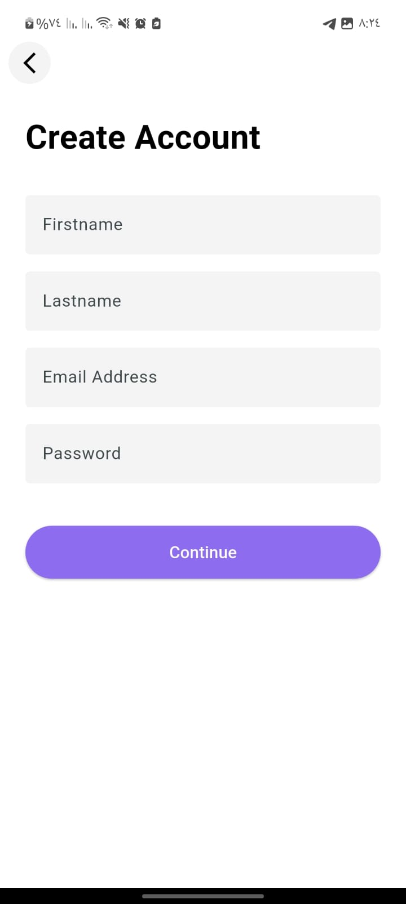 |

| Home & Discovery | Search | Product Details |
|:---:|:---:|:---:|
| 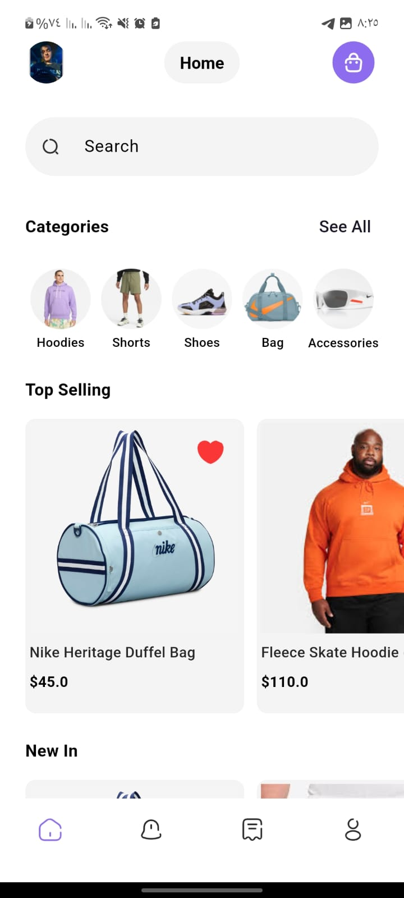 | 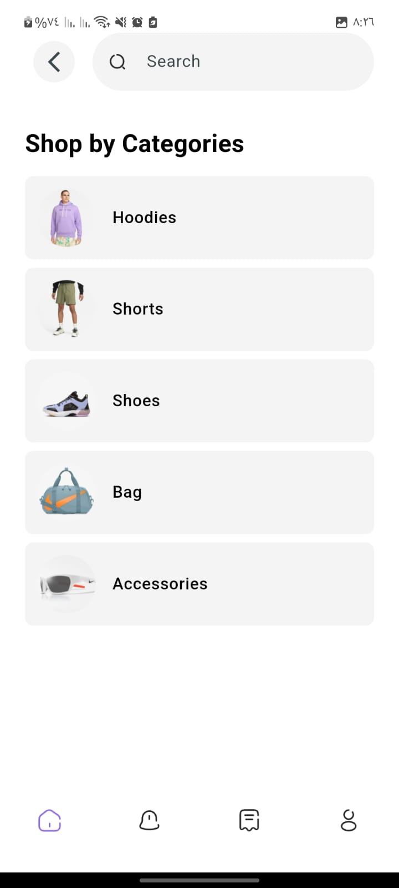 | 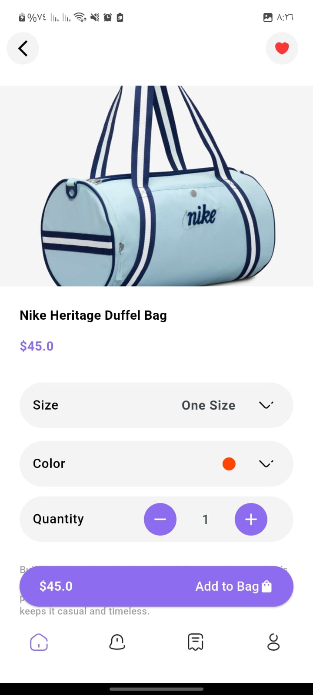 |

| Wishlist | Cart & Checkout | Address Management |
|:---:|:---:|:---:|
| 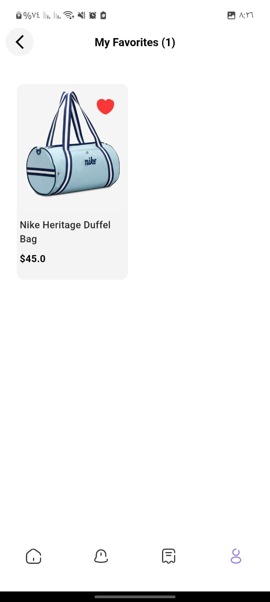 | 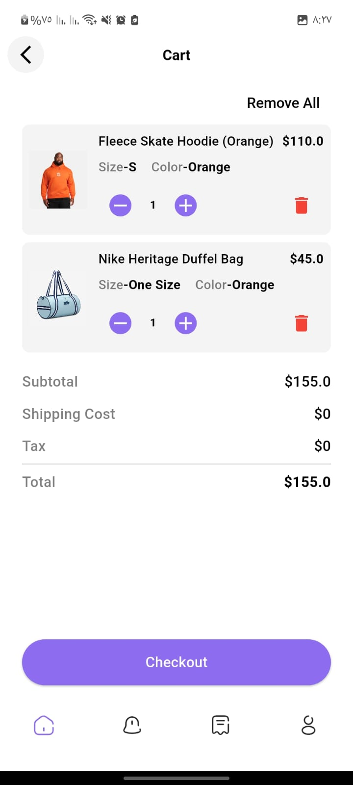 | 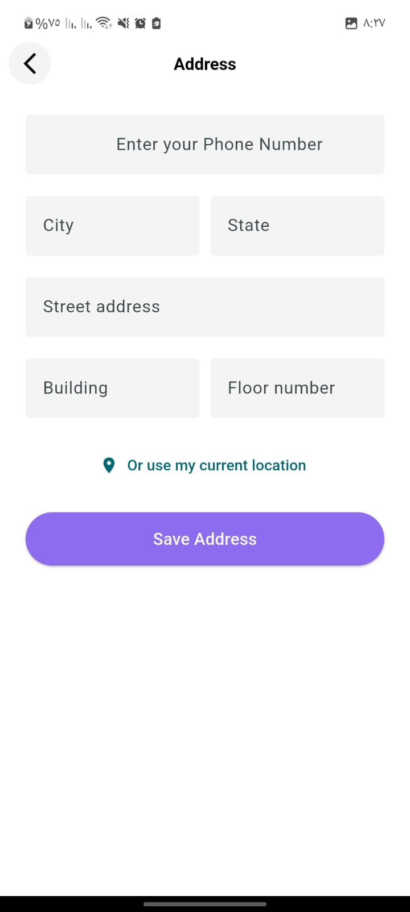 |

| Orders List | Order Details | Profile |
|:---:|:---:|:---:|
| 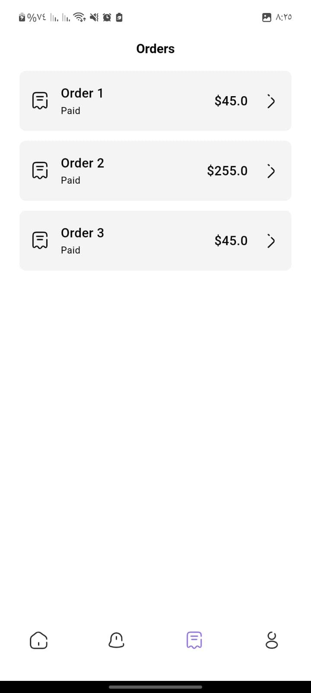 | 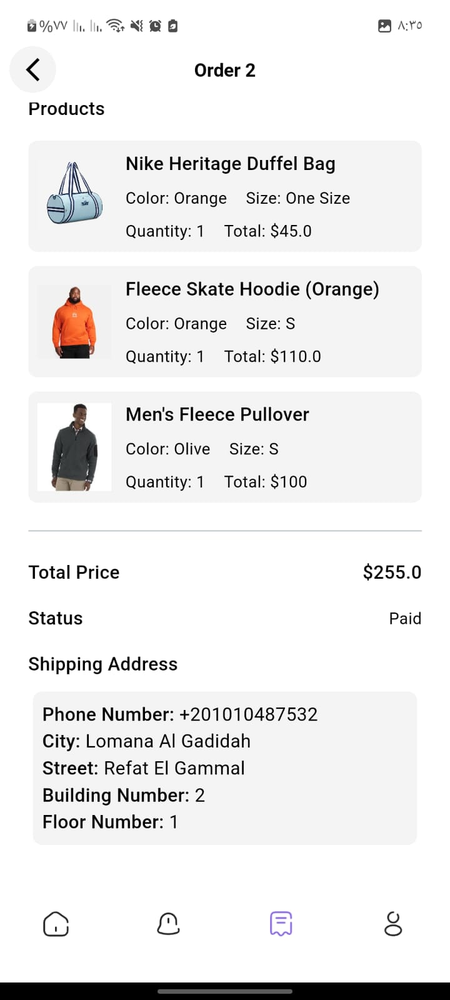 | 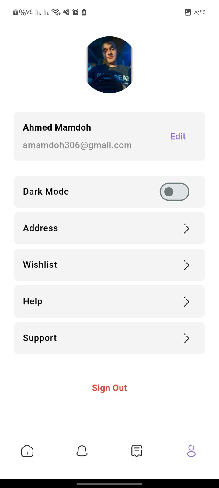 |

| Notifications | Dark Mode | |
|:---:|:---:|:---:|
| 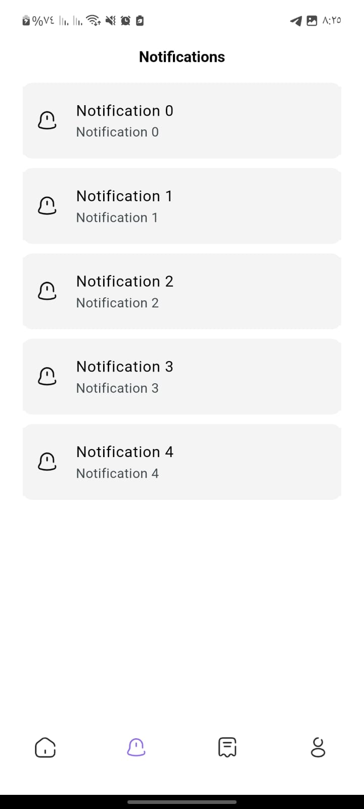 |  | |

---

## ✨ Key Features

### 🔐 Authentication & User Management
- **Secure Sign In/Sign Up**: Support for Email/Password and Google Sign-In.
- **Profile Management**: Update user details, manage saved addresses.
- **Supabase Auth Integration**: Robust backend handling for user sessions.

### 🛍️ Shopping Experience
- **Product Discovery**: Browse products by category or featured collections.
- **Smart Search**: Debounced search functionality for efficient product lookup.
- **Product Details**: Rich product views with image galleries, descriptions, and related items.
- **Wishlist**: Save favorite items for later.

### 🛒 Cart & Checkout
- **Cart Management**: Add/remove items, update quantities.
- **Address Management**: Add, edit, and select delivery addresses.
- **Payment Integration**: Secure payments powered by **Stripe**.
- **Order Tracking**: View past orders and current order status (Pending, Delivered, etc.).

### 🎨 UI/UX & Theming
- **Responsive Design**: Adapts to different screen sizes using `flutter_screenutil`.
- **Dark/Light Mode**: Smooth theme switching with generic animations using `animated_theme_switcher`.
- **Interactive Elements**: Skeleton loading states (`skeletonizer`), bottom sheets for quick actions, and seamless navigation with `go_router`.

### 🔔 Notifications
- **Push Notifications**: Integrated with **Firebase Cloud Messaging**.
- **Local Notifications**: Handling foreground notifications efficiently.

---

## 🛠️ Tech Stack & Architecture

### Frontend
- **Framework**: Flutter (Dart)
- **State Management**: [Riverpod](https://riverpod.dev/) (Hooks Riverpod, Generators)
- **Navigation**: [GoRouter](https://pub.dev/packages/go_router)
- **Forms**: User input handling with `flutter_hooks`.

### Backend & Services
- **Backend-as-a-Service**: [Supabase](https://supabase.com/) (Database, Auth, Storage).
- **Payments**: [Stripe](https://stripe.com/).
- **Notifications**: Firebase (FCM) & Flutter Local Notifications.
- **Location**: Geolocator & Geocoding for address services.

### Architecture
- **Feature-First / Clean Architecture**: Codebases organized by feature (Auth, Cart, Home, etc.) rather than technical layer (Views, Controllers), ensuring scalability and maintainability.
- **Environment Management**: Configuration via `.env` files using `flutter_dotenv`.

---

## 🚀 Getting Started

### Prerequisites
- Flutter SDK (stable channel)
- Dart SDK
- A Supabase project
- A Stripe account
- A Firebase project (for notifications)

### Installation

1. **Clone the repository:**
   ```bash
   git clone https://github.com/Ahmed-Mamdouh-Elattar/e-commerce.git
   cd e_commerce
   ```

2. **Install Dependencies:**
   ```bash
   flutter pub get
   ```

3. **Environment Setup:**
   Create a `.env` file in the root directory and add your API keys:
   ```env
   SUPABASE_URL=your_supabase_url
   SUPABASE_ANON_KEY=your_supabase_anon_key
   STRIPE_PUBLISHABLE_KEY=your_stripe_publishable_key
   # Add other keys as required
   ```

4. **Run the App:**
   ```bash
   flutter run
   ```

## 📂 Project Structure

```
lib/
├── core/                   # Core utilities, widgets, theme, and config
├── feature/                # Feature-based modules
│   ├── address/            # Address management logic & UI
│   ├── authentication/     # Auth logic (Sign in, Sign up)
│   ├── cart/               # Cart functionality
│   ├── home/               # Main dashboard & product listing
│   ├── notification/       # Notification services
│   ├── orders/             # Order history & details
│   ├── payment/            # Stripe integration
│   ├── profile/            # User profile settings
│   ├── search/             # Product search feature
│   ├── theme/              # Theme logic
│   └── wishlist/           # Favorites management
└── main.dart               # Entry point & App initialization
```


